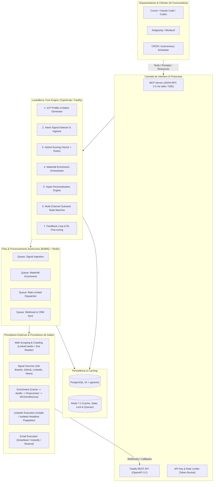

# Arquitetura do Sistema — LookaBerry

---

## 1. Visão Geral

O LookaBerry é uma arquitetura orientada a serviços assíncronos e orientada a ferramentas (Tool-Oriented Architecture), projetada para ser invocada por agentes de IA e LLMs via Model Context Protocol (MCP) e endpoints REST compatíveis com OpenAPI 3.1.

O sistema opera de forma headless e modular, delegando processamento pesado e I/O de rede para filas com controle fino de taxa e concorrência.

---

## 2. Diagrama de Arquitetura

---

## 3. Componentes Principais e Responsabilidades

### 3.1. MCP Server Gateway (`src/mcp/`)
- Implementa o protocolo MCP sobre `stdio` (para uso local pelo Cursor/Claude Code) e `SSE` (Server-Sent Events) para orquestrações distribuídas.
- Expõe um catálogo estrito de 8 tools tipadas com validação Zod.
- Provê resources em tempo real (métricas de campanha, logs de execução) e prompts estruturados.

### 3.2. ICP Profiler Engine (`src/core/icp/`)
- Recebe a URL do website e o briefing inicial do cliente.
- Efetua crawling com o motor de alta performance do **LookaCrawler**, com remoção de boilerplate HTML, poda agressiva de ruído (>70% de economia de tokens), `@mozilla/readability` e `Turndown`.
- Sintetiza as dores, personas ideais e propostas de valor, gerando embeddings de 1536 dimensões para armazenamento no `pgvector`.

### 3.3. Intent Signal Engine (`src/core/signals/`)
- Ingestão contínua de gatilhos de compra em tempo real:
  - **Hiring**: Novas vagas em áreas estratégicas (engenharia, vendas, financeiro).
  - **Funding**: Notícias de rodadas de investimento e expansão.
  - **Tech Stack**: Detecção de novas tecnologias instaladas ou abandonadas.
  - **Leadership**: Novas contratações C-Level ou VP.
- Todo sinal possui pontuação inicial (0-100) e data de expiração (TTL) para evitar abordagens frias com base em notícias antigas.

### 3.4. Hybrid Scoring Engine (`src/core/scoring/`)
- Combina a aderência estática (distância de cosseno entre o lead/empresa e o perfil de ICP no pgvector) com a urgência dinâmica dos sinais de intenção ativos.
- Cálculo de score puramente determinístico e em nível de banco de dados, resultando em **zero tokens de LLM gastos para ranquear milhares de leads**.

### 3.5. Waterfall Enrichment Orchestrator (`src/core/enrichment/`)
- Resolve dados de contato de forma escalonada para otimizar custos de créditos:
  1. Consulta ao cache local de contatos já verificados.
  2. Consulta Apollo e, em caso de ausência ou falha, Dropcontact.
  3. Validação de entregabilidade por MX antes de marcar como `VERIFIED`.
  4. Registra cada tentativa, status, payload sanitizado e créditos em `enrichment_logs`.
  5. Processa jobs em BullMQ com limite de taxa, retries e backoff exponencial.

### 3.6. Hyper-Personalization Engine (`src/core/personalization/`)
- Constrói o gancho (hook) inicial cruzando estritamente:
  - Contexto da empresa e cargo do lead.
  - O sinal de intenção específico detectado.
  - A dor do ICP correspondente.
- Utiliza **Prompt Caching** da Anthropic para reduzir a latência e o custo de inferência em até 90%.

### 3.7. Multi-Channel Outreach Dispatcher (`src/core/outreach/`)
- Máquina de estados para cadências multicanal: Conexão no LinkedIn $\rightarrow$ Mensagem de Boas-vindas $\rightarrow$ Cold Email $\rightarrow$ Follow-up por e-mail.
- Orquestrador de segurança com controle de limites diários e jitter estocástico para proteção de contas.

### 3.8. Analytics & Continuous Learning Loop (`src/core/analytics/`)
- Captura de eventos via `POST /api/v1/webhooks/outreach` (abertura, clique, resposta e bounce).
- Agregação transacional em `campaign_metrics`, com taxas calculadas na consulta MCP.
- Classificação de resposta via Haiku; resultados abaixo de 85% ficam marcados para revisão humana.
- Resposta pausa sequências ativas, atualiza o status do lead e ajusta o peso do sinal associado em passos de 5 pontos, limitado entre 0 e 100.
