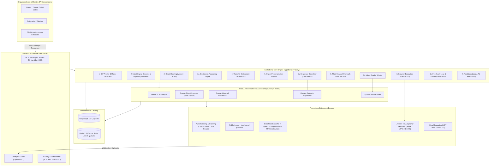

# Arquitetura do Sistema — LookaBerry

> **Última atualização**: 2026-08-22 · **Versão**: S6 complete, 172 tests

---

## 1. Visão Geral

O LookaBerry é uma arquitetura orientada a serviços assíncronos e orientada a ferramentas (Tool-Oriented Architecture), projetada para ser invocada por agentes de IA e LLMs via Model Context Protocol (MCP) e endpoints REST compatíveis com OpenAPI 3.1.

O sistema opera de forma headless e modular, delegando processamento pesado e I/O de rede para filas com controle fino de taxa e concorrência. A partir da S6, o sistema possui **loop autônomo completo**: scheduler → dispatcher → inbox reader → feedback loop, sem intervenção humana.

---

## 2. Diagrama de Arquitetura



---

## 3. Componentes Principais e Responsabilidades

### 3.1. MCP Server Gateway (`src/mcp/`)
- Implementa o protocolo MCP sobre `stdio` (para uso local pelo Cursor/Claude Code) e `SSE` (Server-Sent Events) para orquestrações distribuídas.
- Expõe um catálogo estrito de **9 tools** tipadas com validação Zod.
- As tools delegam aos serviços core; resources e prompts adicionais não fazem parte do catálogo implementado nesta versão.

### 3.2. ICP Profiler Engine (`src/core/icp/`)
- Recebe a URL do website e o briefing inicial do cliente.
- Efetua crawling com o motor de alta performance do **LookaCrawler**, com remoção de boilerplate HTML, poda agressiva de ruído (>70% de economia de tokens), `@mozilla/readability` e `Turndown`.
- Sintetiza as dores, personas ideais e propostas de valor, gerando embeddings de 1536 dimensões para armazenamento no `pgvector`.

### 3.3. Intent Signal Engine (`src/core/intent/`)
- Separa coleta, normalização, classificação, confiança, persistência e scoring por meio do contrato `SignalProvider`.
- Providers locais implementados: `website-changes`, `hiring` e `public-announcements`; o adapter `funding-api` retorna explicitamente `REQUIRES_CREDENTIALS` sem simular uma integração paga.
- Sinais podem vir de snapshots, HTML, itens normalizados ou URLs públicas. Cada sinal registra provider, fonte, URL, observação, TTL, confiança, qualidade da fonte, custo, classificação de evidência, payload normalizado/sanitizado e chave de deduplicação.
- A coleta reporta `IMPLEMENTED`, `NOT_AVAILABLE`, `FAILED`, `TIMEOUT`, `PARTIALLY_IMPLEMENTED` ou `REQUIRES_CREDENTIALS`; falhas não são convertidas silenciosamente em sinais válidos.

### 3.4. Hybrid Scoring Engine (`src/core/intent/service.ts` + `scoring.ts`)
- Combina a aderência estática (distância de cosseno entre a empresa e o perfil de ICP no pgvector) com sinais ativos ponderados por recência/TTL, confiança, qualidade da fonte, tipo, classificação e peso configurável.
- Deduplica contribuições por chave de evento, ignora sinais expirados/inativos e usa desempate estável por identificador.
- O ranking é determinístico e não usa LLM. Sem `OPENAI_API_KEY`, o embedding SHA-256 é somente fallback offline e não representa similaridade semântica.

### 3.5. Decision & Reasoning Engine (`src/core/decision/`)
- Transforma sinais ativos + evidências + ICP fit em `OpportunityScore` determinístico, sem LLM.
- Pipeline: 40% signal score (recência, confiança, classificação, dedup), 25% evidence strength (FACT > INFERENCE > UNVERIFIED), 20% ICP fit (pgvector cosine distance), 15% lead seniority match (C-Level > VP > Director > Manager).
- Gera `WHY_NOW` por tipo de sinal e `RecommendedAction` com canal, timing, template interpolado e rationale.
- Tool MCP: `gtm_evaluate_opportunity`.

### 3.6. Waterfall Enrichment Orchestrator (`src/core/enrichment/`)
- Resolve dados de contato de forma escalonada: Cache local → Apollo → Dropcontact → MX/ZeroBounce.
- Registra cada tentativa, status, payload sanitizado e créditos em `enrichment_logs`.
- Processa jobs em BullMQ com limite de taxa, retries e backoff exponencial.

### 3.7. Hyper-Personalization Engine (`src/core/personalization/`)
- Constrói o gancho (hook) inicial cruzando: contexto da empresa + cargo do lead + sinal de intenção ativo + dor do ICP.
- Utiliza **Prompt Caching** da Anthropic para reduzir latência e custo de inferência em até 90%.
- Guardrails: bloqueio de palavras de spam, clichês de IA e mensagens acima do limite do canal.

### 3.8. Channel Abstraction (`src/core/channels/`)
- `ChannelId` (`linkedin`, `email`, `whatsapp`, `manual`): identificadores abertos, não vinculados ao enum Prisma.
- `ChannelCapability`: `connect`, `sendMessage`, `readMessages`, `searchProfiles`, `followUp`, `verifyDelivery`.
- `ChannelProfile`: limites operacionais por canal (`defaultDailyLimit`, `rateLimitWindowMs`, `safetyPauseMs`).
- `ChannelRegistry`: mapeia `ChannelId → ChannelProfile`, expõe `can(channel, capability)` e `getProfile(channel)`.
- `buildRecommendedActions` filtra ações por `ChannelRegistry.can()`.

### 3.9. Browser Execution Protocol (`src/core/execution/`) — S5
- **ChannelAdapter**: contrato que todo adaptador implementa (`execute`, `canHandle`).
- **ExecutionContext**: lead, company, account (com credenciais/session), message, dryRun.
- **ExecutionResult**: success, externalId, error, retryable, rateLimitHit, channelPausedUntil.
- **ExecutionRouter**: recebe `RecommendedAction`, seleciona `ChannelAdapter` pelo `ChannelId`, valida capability no `ChannelRegistry`, chama `execute`.
- **LinkedInAdapter**: usa a extensão Antigravity (bridge HTTP `127.0.0.1:8765`) como único meio de comunicação com o LinkedIn. Health check obrigatório antes de qualquer ação.
- **AntigravityClient**: cliente HTTP tipado com timeout (30s ações, 5s health), retry (2x, backoff 2s/4s), classificação de erros (`ECONNREFUSED → retryable`, `429/CAPTCHA → rateLimitHit + pausa 48h`, `403 → permanent`).
- **Regra GLOBAL**: NUNCA usar Playwright/Puppeteer/Selenium/Chrome DevTools MCP. Sempre pela extensão Antigravity.

### 3.10. Autonomous Outreach Loop (`src/core/execution/`) — S6

#### 3.10a. Sequence Scheduler (`scheduler.ts`)
- Polling interno via `setInterval` (default 60s), configurável.
- Query: `outreach_sequences` onde `status=ACTIVE AND nextRunAt <= NOW AND (pausedUntil IS NULL OR pausedUntil <= NOW)`.
- Enfileira `{ sequenceId }` em `outreach_dispatcher_queue`.
- Métodos `start()` / `stop()` para controle do ciclo de vida (idempotentes).
- Graceful degradation: se BullMQ offline, loga warning e pula — não crasha.

#### 3.10b. Dispatcher Worker (`dispatcher.ts`) — Corrigido S6
- BullMQ worker em `outreach_dispatcher_queue`.
- Processa **UM step** por job: `sequence.steps[sequence.nextStep]`.
- Para cada lead com mensagem pendente no step atual, monta `ExecutionContext`, aplica `applyAntiBanPolicy`, chama `executionRouter.execute()`.
- Delay humano gaussiano entre ações (45–210s).
- Após enviar todos os leads do step, avança `nextStep` e seta `nextRunAt = NOW() + currentStep.delayHours`.
- **Não processa todos os steps de uma vez** — o scheduler pega o próximo step quando `nextRunAt` vencer.
- Integra `handlePostSendFeedback` para agendar verificação de entrega pós-envio.

#### 3.10c. Inbox Reader Worker (`inboxWorker.ts`)
- BullMQ worker em `outreach_inbox_queue`.
- `classifySentiment()`: heurística keyword-based para POSITIVE/NEGATIVE/AMBIGUOUS (offline, sem LLM).
- `processReply()`: cria `LeadInteractionFeedback`, atualiza `OutreachMessage.status = REPLIED`, `Lead.status` → `REPLIED_POSITIVE`/`UNSUBSCRIBED`/`ENGAGED`, pausa sequências ativas, ajusta `IntentSignal.intentWeight` ±5, faz upsert em `CampaignMetric`.
- Estrutura preparada para integração com `AntigravityClient.readInbox()` quando os dados brutos do inbox estiverem disponíveis.

#### 3.10d. Feedback Loop (`feedbackLoop.ts`)
- `scheduleDeliveryVerification()`: enfileira job delayed (24h) para verificar se a conexão LinkedIn foi aceita.
- `executeDeliveryVerification()`: chama `LinkedInAdapter.verifyDelivery` → marca `OutreachMessage.status = DELIVERED`.
- `adjustIntentWeight()`: ±5 pontos baseado no sentimento da reply (clamped 0–100).
- `handlePostSendFeedback()`: bridge chamada pelo dispatcher após cada send bem-sucedido.

### 3.11. Analytics & Continuous Learning (`src/core/analytics/`)
- Captura de eventos via `POST /api/v1/webhooks/outreach`.
- Agregação transacional em `campaign_metrics`.
- Classificação de resposta via Haiku (ou heurística offline); resultados <85% marcados para revisão humana.
- Resposta pausa sequências ativas e ajusta peso do sinal ±5.

### 3.12. Entity & Evidence Graph (`src/core/evidence/`)
- `Source`, `Person`, `Identity`, `CompanyEvidence`, `PersonEvidence`, `Observation`, `Relationship`, `Interaction`.
- Evidências com `FACT`, `INFERENCE`, `LLM_INFERENCE`, `USER_PROVIDED`, `UNVERIFIED`.
- Sanitização de dados sensíveis, hash SHA-256, TTL opcional.
- `Lead.personId` mantém compatibilidade com modelo legado.

---

## 4. Fluxo de Dados do Loop Autônomo (S6)

```
┌─────────────────────────────────────────────────────────────────┐
│                    AUTONOMOUS OUTREACH LOOP                       │
│                                                                   │
│  ┌──────────┐    ┌──────────────┐    ┌────────────────┐         │
│  │ Scheduler │───>│  Dispatcher  │───>│ Feedback Loop  │         │
│  │ (cron 60s)│    │ (1 step/job) │    │ (24h verify)   │         │
│  └──────────┘    └──────────────┘    └────────────────┘         │
│       │                 │                      │                  │
│       │          ┌──────▼──────┐               │                  │
│       │          │ LinkedIn    │               │                  │
│       │          │ Adapter     │               │                  │
│       │          │ (Antigravity│               │                  │
│       │          │  Bridge)    │               │                  │
│       │          └──────┬──────┘               │                  │
│       │                 │                      │                  │
│       │          ┌──────▼──────┐    ┌─────────▼─────────┐       │
│       └──────────│ nextRunAt = │    │  Inbox Worker     │       │
│                  │ NOW+delayH  │    │  (reply detect)   │       │
│                  └─────────────┘    └─────────┬─────────┘       │
│                                               │                  │
│                                        ┌──────▼──────┐          │
│                                        │ Lead Status │          │
│                                        │ + Feedback  │          │
│                                        │ + Weight Adj│          │
│                                        └─────────────┘          │
└─────────────────────────────────────────────────────────────────┘
```

---

## 5. Filas BullMQ

| Fila | Worker | Status |
| :--- | :--- | :--- |
| `icp_analysis_queue` | `icpWorker` | ✅ Active (nada enfileira — consumo direto) |
| `waterfall_enrichment_queue` | `enrichmentWorker` | ✅ Active |
| `signal_ingestion_queue` | ❌ Nenhum | ⚠️ Queue criada, sem worker |
| `outreach_dispatcher_queue` | `dispatcherWorker` | ✅ Active (S5 dispatcher + S6 scheduler) |
| `outreach_inbox_queue` | `inboxWorker` | ✅ Active (S6 inbox reader) |

---

## 6. Adapters de Canal

| Canal | Adapter | Status |
| :--- | :--- | :--- |
| `linkedin` | `LinkedInAdapter` | ✅ Implementado (Antigravity bridge) |
| `email` | `EmailAdapter` | ⚠️ Stub (`NOT_IMPLEMENTED`) |
| `whatsapp` | `WhatsAppAdapter` | ⚠️ Stub (`NOT_IMPLEMENTED`) |
| `manual` | `ManualAdapter` | ✅ Implementado (always success for `followUp`) |