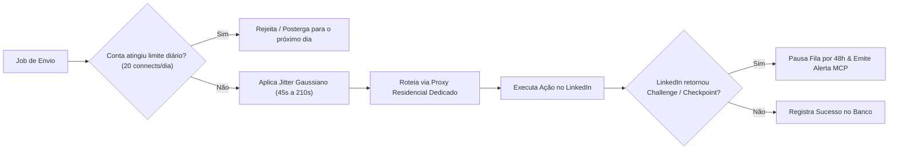

# Segurança, Proteção de Contas e Compliance (LGPD/GDPR) — LookaBerry

---

## 1. Proteção de Contas do LinkedIn (Anti-Ban Engine)

O LinkedIn implementa heurísticas agressivas de detecção de automação (comportamento de bot, IP fingerprinting, picos repentinos de atividade). O LookaBerry aplica salvaguardas nativas:

### 1.1. Salvaguardas Específicas do LinkedIn
- **Quotas Diárias Conservadoras**: Máximo de 15 a 25 pedidos de conexão por dia e 30 mensagens por dia por conta.
- **Jitter Estocástico (Gaussiano)**: Delays aleatórios entre 45 e 210 segundos entre cada ação, simulando ritmo humano natural de digitação e navegação.
- **Isolamento de IP e Sessão**: Cada conta do LinkedIn vinculada opera com cookies isolados e trafega obrigatoriamente através de um proxy residencial estático na mesma cidade/região do proprietário da conta.
- **Circuit Breaker Automático**: Caso o LinkedIn retorne erro 429 ou sinalize verificação de segurança, a conta é imediatamente colocada em quarentena de 48 horas no Redis e um aviso é emitido via log de auditoria.

---

## 2. Proteção de Entregabilidade de E-mail (Anti-Spam)

- **Zero Bounce Policy**: Nenhum e-mail de prospecção deve ser enviado sem validação de entregabilidade. A implementação atual faz preflight MX e registra o resultado; a integração ZeroBounce deve ser habilitada com `ZEROBOUNCE_API_KEY` antes de produção.
- **Auditoria de provedores**: Apollo, Dropcontact e o validador registram status, custo e resposta em `enrichment_logs`; chaves nunca são persistidas nessa tabela.
- **Inbox Rotation**: Distribuição de volume entre múltiplos domínios e caixas postais (máximo de 35 a 45 e-mails diários por inbox com warmup ativo).
- **Spam Trigger Words Guard**: Scanner interno de regex que rejeita assuntos e corpos de e-mail com palavras de alto risco de filtro de spam (ex: *"Grátis"*, *"Oferta imperdível"*, *"100% garantido"*).

---

## 3. Privacidade e Conformidade Legal (LGPD / GDPR)

### 3.1. Base Legal para Prospecção B2B
- O tratamento de dados corporativos (nome, cargo, e-mail de trabalho, empresa) baseia-se no **Legítimo Interesse** (Art. 7º, IX da LGPD e Art. 6(1)(f) do GDPR) para ofertas estritamente B2B pertinentes à função exercida pelo titular.

### 3.2. Mecanismo Automático de Opt-Out (Descadastramento)
- Todo webhook de resposta recebida passa por análise léxica. Caso o lead manifeste desinteresse (*"favor remover meu contato"*, *"não temos interesse"*, *"descadastrar"*), o sistema:
  1. Marca o status do lead como `UNSUBSCRIBED`.
  2. Adiciona o e-mail e o domínio à tabela `global_suppression_list`.
  3. Cancela imediatamente todas as próximas etapas da sequência agendadas para aquele contato.

### 3.3. Endpoint de Direito ao Esquecimento (`/v1/leads/{id}/anonymize`)
- Sob demanda do titular ou do operador, o endpoint anonimiza todos os dados pessoais do lead, substituindo-os por hashes SHA-256 irreversíveis para preservar a integridade das métricas agregadas de campanhas sem armazenar PII (Personally Identifiable Information).

### 3.4. Webhooks de Outreach (Sprint 6)
- O endpoint normalizado `POST /api/v1/webhooks/outreach` deve ficar atrás do gateway interno ou de autenticação de assinatura do provedor antes de exposição pública.
- O contrato atual não valida assinaturas nativas de Smartlead, Resend ou Unipile; adaptadores de produção devem verificar assinatura, timestamp/nonce e prevenir reentrega antes de encaminhar o evento normalizado.
- O conteúdo de respostas é armazenado em `lead_interaction_feedback`; aplicar retenção compatível com a política de privacidade e evitar registrar tokens, credenciais ou payloads desnecessários.
