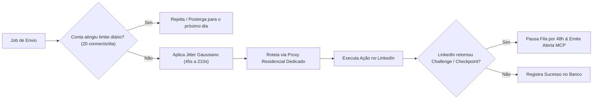

# Security, Account Protection & Compliance (LGPD/GDPR) — LookaBerry

> **Last updated**: 2026-08-24 · **Sprint**: S15 (Security & Governance)

---

## 1. API Key Lifecycle & Access Control (S7 + S15)

### 1.1. Key Types
- **Env-var keys**: Static keys in `API_KEYS` env var — ADMIN level, for bootstrapping
- **DB-managed keys** (S15): Created via admin API, stored in `api_keys` table, with RBAC permissions

### 1.2. Key Lifecycle (S15)
1. **Create**: `POST /api/v1/admin/api-keys` → returns plain key once (prefixed `lb_`)
2. **Rotate**: `POST /api/v1/admin/api-keys/:id/rotate` → new key issued, old key deactivated
3. **Revoke**: `DELETE /api/v1/admin/api-keys/:id` → immediate deactivation, audit trail recorded
4. **Auto-expire**: Keys with `expiresAt` are auto-deactivated on validation
5. **List**: `GET /api/v1/admin/api-keys` → active keys with preview (first 6 + last 4 chars)

### 1.3. RBAC Hierarchy (S15)

| Level | Read | Create | Update | Delete | Admin |
| :--- | :---: | :---: | :---: | :---: | :---: |
| **ADMIN** | All | All | All | All | All |
| **OPERATOR** | campaigns, leads, audit, suppression | campaigns, leads, suppression | campaigns, leads, suppression | campaigns, leads | — |
| **CAMPAIGN_MANAGER** | campaigns, leads (assigned) | campaigns, leads (assigned) | campaigns, leads (assigned) | — | — |
| **VIEWER** | campaigns, leads (assigned) | — | — | — | — |

### 1.4. Campaign Isolation
- `CAMPAIGN_MANAGER` and `VIEWER` are restricted to explicitly assigned `campaignIds`
- `ADMIN` and unrestricted `OPERATOR` (empty `campaignIds`) have global access
- Every admin route uses `requireAdmin()` or `requireOperator()` preHandler

---

## 2. LinkedIn Account Protection (Anti-Ban Engine)

O LinkedIn implementa heurísticas agressivas de detecção de automação (comportamento de bot, IP fingerprinting, picos repentinos de atividade). O LookaBerry aplica salvaguardas nativas:

### 2.1. Salvaguardas Específicas do LinkedIn
- **Quotas Diárias Conservadoras**: Máximo de 15 a 25 pedidos de conexão por dia e 30 mensagens por dia por conta.
- **Jitter Estocástico (Gaussiano)**: Delays aleatórios entre 45 e 210 segundos entre cada ação, simulando ritmo humano natural de digitação e navegação.
- **Isolamento de IP e Sessão**: Cada conta do LinkedIn vinculada opera com cookies isolados e trafega obrigatoriamente através de um proxy residencial estático na mesma cidade/região do proprietário da conta.
- **Circuit Breaker Automático**: Caso o LinkedIn retorne erro 429 ou sinalize verificação de segurança, a conta é imediatamente colocada em quarentena de 48 horas no Redis e um aviso é emitido via log de auditoria.

---

## 3. Email Deliverability Protection (Anti-Spam)

- **Zero Bounce Policy**: Nenhum e-mail de prospecção deve ser enviado sem validação de entregabilidade. A implementação atual faz preflight MX e registra o resultado; a integração ZeroBounce deve ser habilitada com `ZEROBOUNCE_API_KEY` antes de produção.
- **Auditoria de provedores**: Apollo, Dropcontact e o validador registram status, custo e resposta em `enrichment_logs`; chaves nunca são persistidas nessa tabela.
- **Inbox Rotation**: Distribuição de volume entre múltiplos domínios e caixas postais (máximo de 35 a 45 e-mails diários por inbox com warmup ativo).
- **Spam Trigger Words Guard**: Scanner interno de regex que rejeita assuntos e corpos de e-mail com palavras de alto risco de filtro de spam (ex: *"Grátis"*, *"Oferta imperdível"*, *"100% garantido"*).
- **Pre-send Suppression Check (S15)**: Antes de qualquer envio, o dispatcher verifica a `global_suppression_list` — leads, e-mails, domínios e URLs de LinkedIn suprimidos são bloqueados automaticamente.

---

## 4. Privacy & Legal Compliance (LGPD / GDPR)

### 4.1. Legal Basis for B2B Outreach
- O tratamento de dados corporativos (nome, cargo, e-mail de trabalho, empresa) baseia-se no **Legítimo Interesse** (Art. 7º, IX da LGPD e Art. 6(1)(f) do GDPR) para ofertas estritamente B2B pertinentes à função exercida pelo titular.

### 4.2. Global Suppression List & Opt-Out Cascade (S15)

Quando um lead realiza opt-out, o sistema executa o cascade completo:
1. Adiciona e-mail, domínio e LinkedIn URL à `global_suppression_list`
2. Marca o lead como `UNSUBSCRIBED`
3. Cancela TODAS as sequências ativas do lead (LeadSequenceState → CANCELLED)
4. Cancela TODAS as mensagens QUEUED/SCHEDULED do lead (status → FAILED, reason: "Lead unsubscribed")
5. Registra trilha de auditoria completa (`LEAD_UNSUBSCRIBED`)

**Pré-envio check**: `shouldBlockLead()` no dispatcher verifica supressão antes de qualquer ação de outreach.

**Endpoints Admin (S15)**:
- `GET /api/v1/admin/suppression` — Listar todas as entradas
- `POST /api/v1/admin/suppression` — Adicionar manualmente
- `DELETE /api/v1/admin/suppression/:id` — Remover entrada
- `GET /api/v1/admin/suppression/check?email=...` — Verificar se está suprimido

### 4.3. Data Retention & Anonymization (S15)

**Políticas padrão** (`data_retention_policies`):

| Entity | Retention | Auto-Anonymize | Auto-Delete |
| :--- | :---: | :---: | :---: |
| LEAD | 730 days (2y) | false (opt-in) | false |
| EMAIL_TRACKING | 90 days | true | false |
| WEBHOOK_PAYLOAD | 30 days | false | true |
| AUDIT_LOG | 1095 days (3y) | false | false |

**Right to Erasure** (Direito ao Esquecimento):
- `POST /api/v1/admin/anonymize/lead/:id` — Anonimização manual sob demanda
- Substitui todos os campos PII (firstName, lastName, fullName, email, phone, linkedinUrl, title, location) por hashes SHA-256 irreversíveis (prefixados `anon_`)
- Preserva integridade das métricas agregadas (mesmo input → mesmo hash)
- `metadata` é substituído por `{ anonymized: true, anonymizedAt: ... }`

**Scheduled Anonymization**:
- `POST /api/v1/admin/retention/run` — Execução manual da anonimização programada
- Configurável via `PUT /api/v1/admin/retention/policies/:entityType`
- Em lote de 100 leads por execução

### 4.4. Webhook Security (S7 + S14 + S15)

- HMAC-SHA256 signatures with timestamp replay protection (±5 min)
- Svix signature validation for Resend webhooks
- X-Hub-Signature-256 for Meta WhatsApp webhooks
- Raw body capture via preParsing hook
- Idempotency via DB UNIQUE constraint + in-memory negative cache
- Status transition validation (no backward transitions, e.g. BOUNCED → OPENED rejected)
- **Payload sanitization (S15)**: Credentials stripped from webhook payloads before storage

### 4.5. Audit Trail (S15)

Toda ação administrativa e operacional é registrada em `audit_logs`:

| Action | Severity | Compliance |
| :--- | :---: | :---: |
| API_KEY_CREATED / ROTATED / REVOKED | INFO / CRITICAL | ✅ Preserved |
| DATA_ANONYMIZED / DATA_DELETED | INFO | ✅ Preserved |
| LEAD_UNSUBSCRIBED | INFO | ✅ Preserved |
| PERMISSION_GRANTED / REVOKED | INFO | ✅ Preserved |
| LOGIN_FAILED | WARNING | — |
| RATE_LIMIT_HIT | WARNING | — |
| SECURITY_ALERT | CRITICAL | — |
| CONFIG_CHANGED | INFO | — |

**Endpoint**: `GET /api/v1/admin/audit?action=...&severity=...&limit=50`

### 4.6. Secrets Masking (S15)

- **Log sanitization**: `sanitizeText()` masks API key patterns (`sk_`, `lb_`, `whsec_`, `Bearer`)
- **Object sanitization**: `sanitizeObject()` recursively redacts fields named `api_key`, `token`, `secret`, `password`, etc.
- **JSON serialization**: `safeStringify()` auto-sanitizes before writing
- **Webhook payloads**: `sanitizeWebhookPayload()` applies provider-specific rules (Resend headers, Smartlead/Unipile api_key fields)
- **URL sanitization**: `sanitizeUrl()` masks query parameters with secret key names

---

## 5. Production Safety Checks

O servidor se recusa a iniciar em produção sem:
- `API_KEYS` configurado (pelo menos uma chave)
- `WEBHOOK_SECRET` configurado
- `CORS_ORIGINS` não contendo `*`

Estas verificações são executadas por `assertProductionSafety()` em `src/config/env.ts`.

---

## 6. Threat Model

Documento completo em [`docs/THREAT_MODEL.md`](./THREAT_MODEL.md).

Resumo dos riscos residuais:
- T-01 Unauthorized API Access: **Low** (defense-in-depth com rotação, revogação, expiração e RBAC)
- T-02 Webhook Replay: **Low** (tripla camada: assinatura + idempotência + validação de transição)
- T-03 Privilege Escalation: **Low** (RBAC matrix + campaign isolation + preHandlers)
- T-04 PII Exposure: **Low-Medium** (anonimização sob demanda + retenção configurável + sanitização de logs)
- T-05 Opt-Out Circumvention: **Low** (cascade multi-canal + pre-send check)
- T-06 Secrets in Logs: **Low** (pattern-based masking + key-name redaction)
- T-07 LinkedIn Ban: **Low-Medium** (anti-ban engine + multi-account rotation)
- T-08 DoS (API): **Medium** (rate limiting com fallback, mas requer WAF para ataques volumétricos)