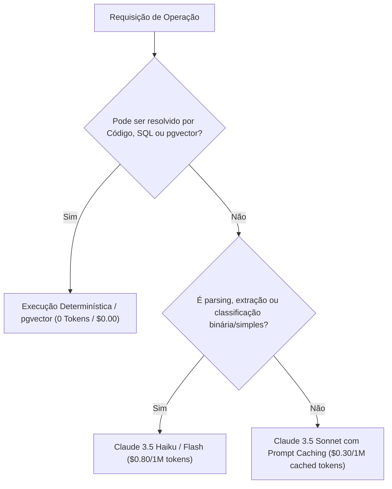

# Estratégia de Otimização de Tokens e Custos — LookaBerry

---

## 1. Princípio Arquitetural: "Deterministic First, Small Model Second, Flagship LLM Only for Synthesis"

Em sistemas de GTM B2B tradicionais, agentes frequentemente gastam centenas de milhares de tokens enviando dumps completos de páginas HTML, perfis de LinkedIn não tratados e tabelas inteiras para modelos caros como GPT-4o ou Claude 3.5 Sonnet.

O LookaBerry adota uma hierarquia estrita de execução:

---

## 2. As 5 Técnicas de Economia de Tokens

### 2.1. Embeddings-First Filtering (Sem Tokens de LLM)
- **Problema**: Fazer um LLM analisar 1.000 leads para escolher os 20 melhores custa ~500.000 tokens por execução.
- **Solução LookaBerry**:
  1. No momento da descoberta, a empresa é convertida em um vetor compacto de 1536 dimensões via `text-embedding-3-small` (custo irrisório de $0.02 / 1M tokens).
  2. O ranqueamento de 50.000 leads ocorre inteiramente dentro do PostgreSQL usando distância de cosseno (`vector_cosine_ops`) combinada com filtros SQL de tamanho de empresa, stack e localização.
  3. A IA cliente recebe apenas o top 20 já ranqueado.

### 2.2. Prompt Caching Nativo (Anthropic Prompt Caching)
- As diretrizes de copywriting, frameworks de resposta B2B, matriz de dores do ICP e regras anti-clichê são empacotadas no bloco estático do prompt com o header `cache-control: {"type": "ephemeral"}`.
- Ao gerar 100 mensagens consecutivas, o prompt estático (cerca de 2.500 tokens) é lido do cache com **90% de desconto no custo** e tempo de resposta reduzido para menos de 1 segundo.

### 2.3. Model Cascading Estruturado

| Camada | Tipo de Tarefa | Modelo Utilizado | Custo Estimado |
| :--- | :--- | :--- | :--- |
| **Tier 0** | Validação sintática, filtros SQL, ranqueamento vetorial, cálculo de scores | PostgreSQL 16 + pgvector | **$0.00** |
| **Tier 1** | Limpeza de texto de vagas de emprego, extração de sinais de notícias, classificação de sentimento | `claude-3-5-haiku-20241022` ou `gemini-1.5-flash` | **$0.80 / 1M tokens** |
| **Tier 2** | Redação do gancho hiper-personalizado e síntese estratégica de dor | `claude-3-5-sonnet-20241022` (com Prompt Caching) | **$0.30 / 1M tokens (cached)** |

### 2.4. Respostas Estritamente Estruturadas (Zod JSON Schemas)
- A comunicação entre os serviços e as tools MCP não contém preâmbulos de conversação ("*Aqui está o rascunho da sua mensagem...*").
- As tools utilizam schemas estruturados rígidos, cortando de 100 a 300 tokens de preenchimento inútil por chamada.

### 2.5. Cache de Dois Níveis (L1 Redis + L2 PostgreSQL)
- **L1 (Redis)**: Resultados de scraping limpos de páginas web de empresas são armazenados por 7 dias.
- **L2 (PostgreSQL)**: E-mails corporativos já enriquecidos e validados por SMTP ficam indexados pelo hash do domínio + nome do lead. Se outra campanha tentar enriquecer o mesmo lead, o custo de API externa e LLM é **zero**.
